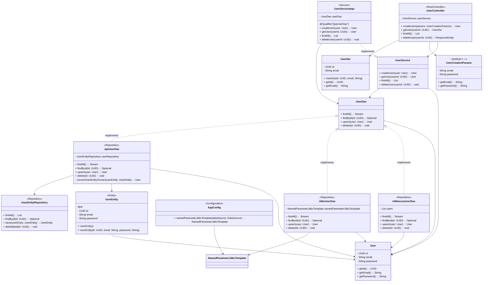

# Spring Boot User Management API
C'est un projet Spring Boot qui expose une API REST pour la gestion des utilisateurs, avec des services pour créer, 
lire, mettre à jour et supprimer des utilisateurs. Le projet utilise différentes implémentations de DAO pour l'accès 
aux données, y compris une implémentation en mémoire, une implémentation JDBC et une implémentation JPA.
# Installation et Lancement
1. Clonez le dépôt :

```sh
git clone https://github.com/VOTRE_UTILISATEUR/VOTRE_DEPOT.git
```
2. Naviguez dans le répertoire du projet :

```sh
cd VOTRE_DEPOT
```
3. Construisez le projet avec Maven :

```sh
mvn clean install
```
4. Lancez l'application :

```sh
mvn spring-boot:run
```
# Utilisation
Accédez à l'API REST pour gérer les utilisateurs :
* Créer un utilisateur :

```sh
POST http://localhost:8080/users
Body: {
    "email": "exemple@example.com",
    "password": "motdepasse"
}
```
* Obtenir un utilisateur :

```sh
GET http://localhost:8080/users/{userId}
```
* Obtenir tous les utilisateurs :

```sh
GET http://localhost:8080/users
```
* Supprimer un utilisateur :

```sh
DELETE http://localhost:8080/users/{userId}
```
# Diagramme de classe

# Description des Classes
## UserController
* Annotation : @RestController
* Description : Contrôleur REST pour gérer les requêtes liées aux utilisateurs.
* Attribut :
  * UserService userService : Injecté par Spring pour accéder au service utilisateur.
* Méthodes :
  * createUser(params: UserCreationParams) : User : Crée un nouvel utilisateur. 
  * getUser(userId: UUID) : UserDto : Récupère les informations d'un utilisateur par son ID. 
  * findAll() : List<UserDto> : Récupère la liste de tous les utilisateurs. 
  * deleteUser(userId: UUID) : ResponseEntity<Void> : Supprime un utilisateur par son ID.
## UserService
* Description : Interface pour le service utilisateur.
* Méthodes :
  * createUser(user: User) : User : Crée un nouvel utilisateur. 
  * getUser(userId: UUID) : User : Récupère un utilisateur par son ID. 
  * findAll() : List<User> : Récupère la liste de tous les utilisateurs. 
  * deleteUser(userId: UUID) : void : Supprime un utilisateur par son ID.
## UserServiceImpl
* Annotation : @Service 
* Description : Implémentation du service utilisateur. 
* Attribut :
  * UserDao userDao : Injecté par Spring pour accéder au DAO utilisateur. 
* Méthodes :
  * createUser(user: User) : User 
  * getUser(userId: UUID) : User 
  * findAll() : List<User>
  * deleteUser(userId: UUID) : void
## User
* Description : Classe représentant un utilisateur. 
* Attributs :
  * UUID id 
  * String email 
  * String password 
* Méthodes :
  * getId() : UUID 
  * getEmail() : String 
  * getPassword() : String
## UserCreationParams
* Annotation : @NotNull @Email @NotEmpty 
* Description : Classe pour les paramètres de création d'utilisateur. 
* Attributs :
  * String email 
  * String password 
* Méthodes :
  * getEmail() : String 
  * getPassword() : String
## UserDto
* Description : Classe pour les données utilisateur exposées via l'API. 
* Attributs :
  * UUID id 
  * String email 
* Méthodes :
  * UserDto(id: UUID, email: String)
  * getId() : UUID 
  * getEmail() : String
## UserDao
* Description : Interface pour le DAO utilisateur. 
* Méthodes :
  * findAll() : Stream<User>
  * findById(id: UUID) : Optional<User>
  * upsert(user: User) : User 
  * delete(id: UUID) : void
## InMemoryUserDao
* Annotation : @Repository 
* Description : Implémentation en mémoire du DAO utilisateur. 
* Attribut :
  * List<User> users 
* Méthodes :
  * findAll() : Stream<User>
  * findById(id: UUID) : Optional<User>
  * upsert(user: User) : User 
  * delete(id: UUID) : void 
## JdbcUserDao
* Annotation : @Repository 
* Description : Implémentation JDBC du DAO utilisateur. 
* Attribut :
  * NamedParameterJdbcTemplate namedParameterJdbcTemplate 
* Méthodes :
  * findAll() : Stream<User>
  * findById(id: UUID) : Optional<User>
  * upsert(user: User) : User 
  * delete(id: UUID) : void
## AppConfig
* Annotation : @Configuration 
* Description : Classe de configuration Spring. 
* Méthode :
  * namedParameterJdbcTemplate(dataSource: DataSource) : NamedParameterJdbcTemplate
## UserEntity
* Annotation : @Entity 
* Description : Classe représentant une entité utilisateur persistée en base de données. 
* Attributs :
  * UUID id 
  * String email 
  * String password 
* Méthodes :
  * UserEntity()
  * UserEntity(id: UUID, email: String, password: String)
## UserEntityRepository 
* Annotation : @Repository 
* Description : Repository JPA pour les entités utilisateur. 
* Méthodes :
  * findAll() : List<UserEntity>
  * findById(id: UUID) : Optional<UserEntity>
  * save(userEntity: UserEntity) : UserEntity 
  * deleteById(id: UUID) : void
## JpaUserDao
* Annotation : @Repository 
* Description : Implémentation JPA du DAO utilisateur. 
* Attribut :
  * UserEntityRepository userRepository : Injecté par Spring pour accéder au repository des entités utilisateur. 
* Méthodes :
  * findAll() : Stream<User>
  * findById(id: UUID) : Optional<User>
  * upsert(user: User) : User 
  * delete(id: UUID) : void 
  * convertUserEntityToUser(userEntity: UserEntity) : User : Convertit une entité utilisateur en objet utilisateur.

# Configuration des Projets et des Profils
## AppConfig
* Annotation : @Configuration 
* Description : Classe de configuration Spring pour les beans. 
* Méthode :
  * namedParameterJdbcTemplate(dataSource: DataSource) : NamedParameterJdbcTemplate : Crée et configure un bean 
  * NamedParameterJdbcTemplate.
# Configuration des Sources de Données
Vous pouvez configurer différentes sources de données dans votre fichier application.properties ou application.yml. 
Voici un exemple pour une base de données MySQL :

```properties
    spring.application.name=demo
    spring.datasource.driver-class-name=com.mysql.cj.jdbc.Driver
    spring.datasource.username=root
    spring.datasource.password=toto
    spring.datasource.url=jdbc:mysql://localhost:3306/SQUAREGAMES_db
    spring.jpa.open-in-view=false
    spring.jpa.hibernate.ddl-auto=update
```
Pour une base de données H2, vous pouvez utiliser la configuration suivante :

```properties
    spring.datasource.url=jdbc:h2:file:~/test;DB_CLOSE_DELAY=-1;AUTO_SERVER=TRUE
    spring.datasource.driverClassName=org.h2.Driver
    spring.datasource.username=sa
    spring.datasource.password=password
    spring.h2.console.enabled=true
```
# Sélection du Profil
Pour activer un profil spécifique lors de l'exécution de l'application, vous pouvez utiliser l'argument de ligne de 
commande --spring.profiles.active :

```sh
    mvn spring-boot:run -Dspring-boot.run.profiles=h2
```
ou

```sh
    java -jar target/votre-application.jar --spring.profiles.active=h2
```
# Dépendances et Configuration Maven
Ajoutez la dépendance pour JPA dans votre fichier pom.xml :

```xml
    <dependency>
        <groupId>org.springframework.boot</groupId>
        <artifactId>spring-boot-starter-data-jpa</artifactId>
    </dependency>
    <dependency>
        <groupId>mysql</groupId>
        <artifactId>mysql-connector-java</artifactId>
    </dependency>
```
Configurez Maven avec votre Personal Access Token (PAT) dans le fichier settings.xml :

```xml
<settings   xmlns="http://maven.apache.org/SETTINGS/1.0.0"
            xmlns:xsi="http://www.w3.org/2001/XMLSchema-instance"
            xsi:schemaLocation="http://maven.apache.org/SETTINGS/1.0.0
                                http://maven.apache.org/xsd/settings-1.0.0.xsd">
    <servers>
        <server>
            <id>github</id>
            <username>YOUR_GITHUB_USERNAME</username>
            <password>YOUR_PERSONAL_ACCESS_TOKEN</password>
        </server>
    </servers>
</settings>
```
Ajoutez le repository GitHub dans votre fichier pom.xml :

```xml
<repositories>
    <repository>
        <id>github</id>
        <url>https://maven.pkg.github.com/le-campus-numerique/*</url>
        <snapshots>
            <enabled>true</enabled>
        </snapshots>
    </repository>
</repositories>
```
