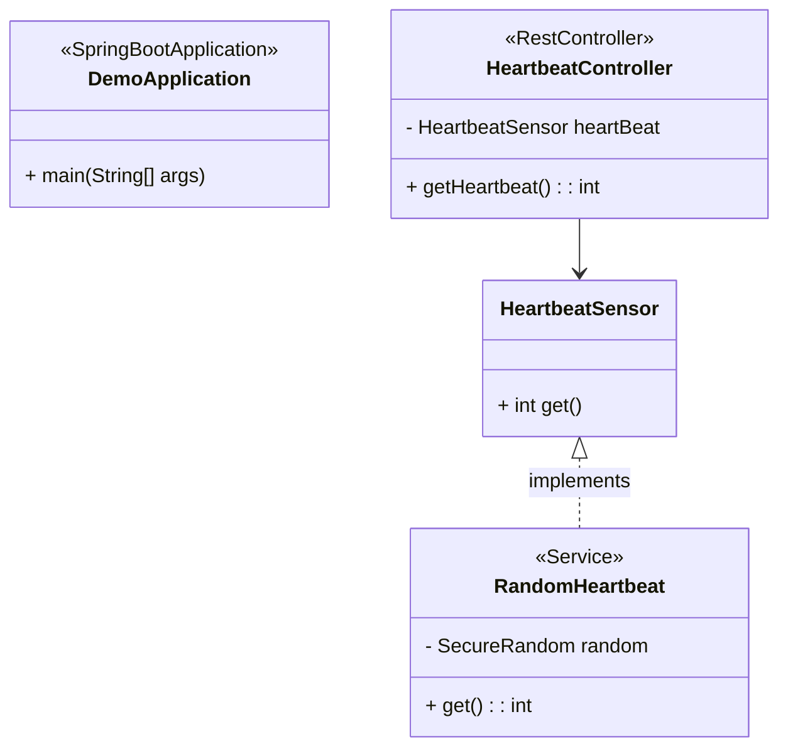

# Classes Principales
## DemoApplication
* Annotation : @SpringBootApplication
* Description : Point d'entrée principal de l'application Spring Boot.
* Méthode :
  - main(String[] args) : void : Lance l'application Spring Boot.
## HeartbeatController
* Annotation : @RestController
* Description : Contrôleur REST pour gérer les requêtes liées au heartbeat.
* Attributs :
  * HeartbeatSensor heartBeat : Injecté par Spring pour accéder au capteur de heartbeat.

* Méthode :
  * getHeartbeat() : int : Retourne la valeur actuelle du heartbeat obtenue depuis HeartbeatSensor.

## HeartbeatSensor
* Description : Interface représentant un capteur de heartbeat.
* Méthode :
  * get() : int : Retourne la valeur actuelle du heartbeat.

## RandomHeartbeat
* Annotation : @Service
* Description : Implémentation du capteur de heartbeat utilisant des valeurs aléatoires.
* Attributs :
  * SecureRandom random : Générateur de nombres aléatoires pour simuler le heartbeat.
* Méthode :
  * get() : int : Retourne une valeur aléatoire comprise entre 0 et 99.

